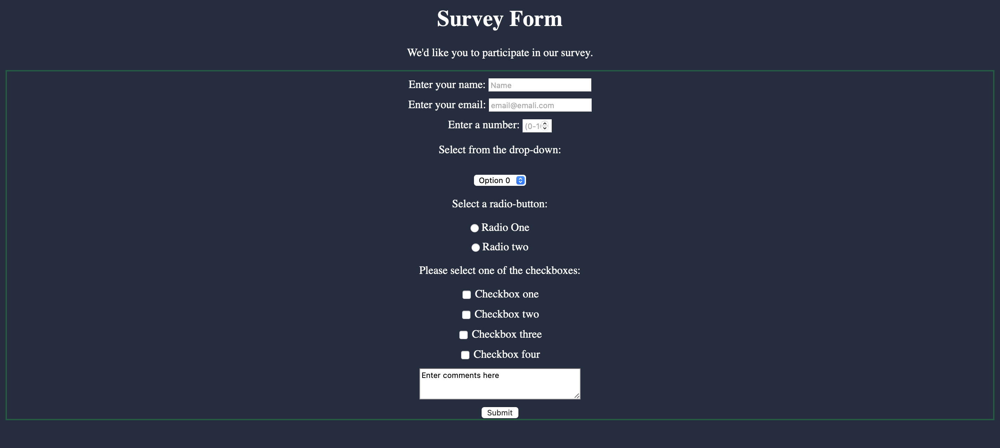

# FormPage

A simple survey form page. 

## Table of Contents 
- [Overview](#overview)
- [Screenshots](#screenshots)
- [Technologies](#technologies) 
- [Setup](#setup) 
- [Contributing](#contributing)

  ## Overview 

This is just a simple survey forms page.

## Screenshots  

### Forms Page 

 
  
## Technologies 

- HTML5 
- CSS3 

## Setup 
  To run this project locally, follow these steps:  
  
  1. Clone the repository
 
```

git clone https://github.com/TheDude-creator/FormPage.git

```

2. Navigate to the project directory

  ```

    cd FormPage
	
 ```

3. Open `index.html` in your browser to view the webpage


## Contributing

Contributions are welcome! If you'd like to contribute, please follow these steps:

1. Fork the repository. Create your feature branch (git checkout -b feature/YourFeature).
2. Commit your changes (git commit -m 'Add some feature').
3. Push to the branch (git push origin feature/YourFeature).
4. Open a pull request.

